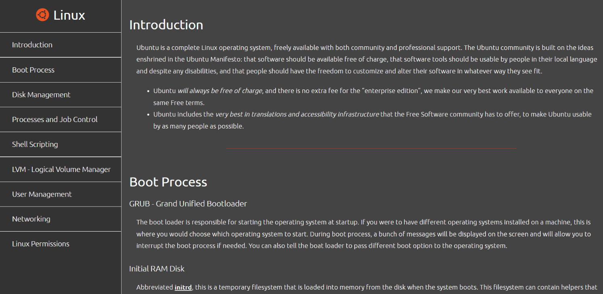

# freeCodeCamp - Technical Documentation Page Project

This is the result of the freeCodeCamp Technical Documentation Page Project on Linux. Go check out this amazing commuity that teaches you coding for free! [freeCodeCamp](https://freecodecamp.org).

## Table of contents

- [Overview](#overview)
  - [The challenge](#the-challenge)
  - [Screenshot](#screenshot)
  - [Links](#links)
- [My process](#my-process)
  - [Built with](#built-with)
  - [What I learned](#what-i-learned)
  - [Useful resources](#useful-resources)
- [Author](#author)

## Overview

### The challenge

Users should be able to:

- View the optimal layout depending on their device's screen size
- The layout should have the navbar on the left hand side on laptop/desktop devices. On smaller devices, the navbar should then place itself over the main content.

### Screenshot

### Links

- Live Site URL: [GitHub Pages](https://mitch-webdev.github.io/technical-documentation-page/)

## My process

### Built with

- Semantic HTML5 markup
- CSS custom properties
- Flexbox

### What I learned

This project taught a lot in terms of HTML semantics and how to structure all HTML elements, all while learning about Linux at the same time. Really enjoyed making this one.

### Useful resources

- [Ubuntu Website](https://ubuntu.com/) - This helped me writing text in this project.
- [Linux Training Academy](https://www.linuxtrainingacademy.com/) - This is an amazing teacher which helped me understand more on Linux OS. I'd recommend it to anyone learning about Linux.

## Author

- GitHub - [mitch-webdev](https://github.com/mitch-webdev)
- freeCodeCamp - [@mitch-webdev](https://www.freecodecamp.org/mitch-webdev)
